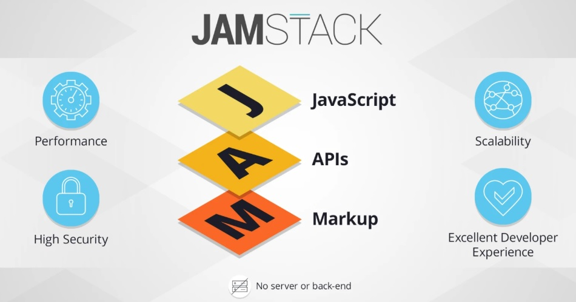

### Technologies used

Stack: <a href="https://jamstack.org/">Jamstack </a>

Framework: <a href="https://www.gatsbyjs.org/">Gatsby.js</a>

Tech behind Gatsby: React, Webpack, modern javascript, css and more

Web Hosting: <a href="https://pages.github.com/">Github Pages</a>

SVN: <a href="https://git-scm.com/">Git</a>

Code Editor: <a href="https://atom.io/">Atom</a>

local Hosting: <a href="https://nodejs.org/en/">node.js</a>


### What is Jamstack?

Many of you should have known web platforms like wordpress and wix.com.
Or othersome traditional web development frameworks like Angular, React, ASP.net.

Entering 2020, there is a revolution in web development industory happening and that is Jamstack.




### Install and Develop Steps

1. Setting up the environment by following -  <a href="https://www.gatsbyjs.org/tutorial/">Gatsby Tutorial</a>

2. Choose a theme starter and install it

For example, the theme I used - <a href="https://www.gatsbyjs.org/starters/LekoArts/gatsby-starter-minimal-blog/">gatsby-starter-minimal-blog</a>:

```cmd
gatsby new minimal-blog LekoArts/gatsby-starter-minimal-blog
```

3. Edit your site with editor and view it through "gatsby develop"

4. Build it through "gatsby build"

5. Publish the site to Github Pages by following - <a href="https://gist.github.com/TylerFisher/6127328">Basic steps for hosting on Github · GitHub</a>


### My experience and thoughts

Before trying out jamstack, I have completed several web application projects using asp.net webform and MVC frameworks,
 and PHP frameworks like wordpress.org and Magento. 


Recommended reading:

 <a href="https://snipcart.com/blog/jamstack">The JAMstack in 2020: Why (and How) to Get Started - Snipcart</a>

Last edited: 24/07/2020


---

