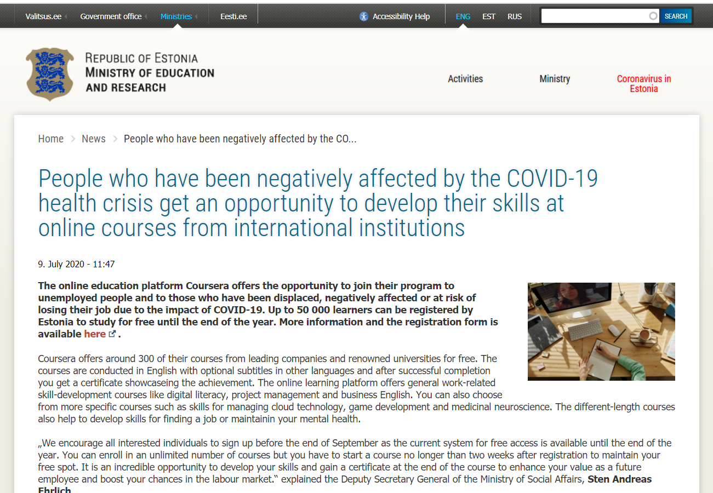

### Estonia, COVID-19 and Coursera

Once again Estonia shows their support for digital society and e-learning.
It has been a hard time for everyone. 

Estonian government cooperated with Coursera to allow up to 50 000 learners can be registered by Estonia to study for free until the end of the year for those
especially who have been affected by covid-19 in Estonia.

I am thankful for that and I have this opportunity to resgister and study as much as I can for free until the end of this year.

Let the second year begin'!

Master life.

Learn hard, work hard, play hard.

news link: https://www.hm.ee/en/news/people-who-have-been-negatively-affected-covid-19-health-crisis-get-opportunity-develop-their

Last editied 9/9/2020

---

